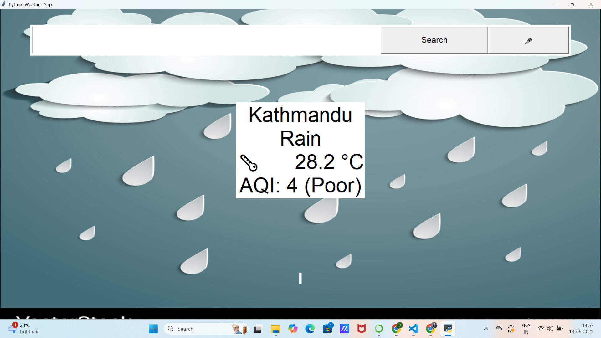

# weather_app
A desktop weather application built with Python and Tkinter that shows current weather conditions, air quality index (AQI), and supports voice input for city search. The app dynamically updates its background based on weather conditions.

 ## Features

- Fetch current weather data from OpenWeatherMap API
- Display temperature, weather description, and AQI with descriptive labels
- Dynamic background images based on weather (rainy, cloudy, sunny, etc.)
- Voice input to search city names using speech recognition
- Automatic location detection using IP geolocation
- Responsive GUI built with Tkinter

  ## Screenshots

  

  


  ## Requirements

- Python 3.x
- Modules:
  - tkinter (usually comes pre-installed with Python)
  - requests
  - geocoder
  - pillow (PIL)
  - speech_recognition
  - pyaudio (for microphone access, platform-specific install required)

Install dependencies via pip:

```bash
pip install requests geocoder pillow speechrecognition pyaudio
